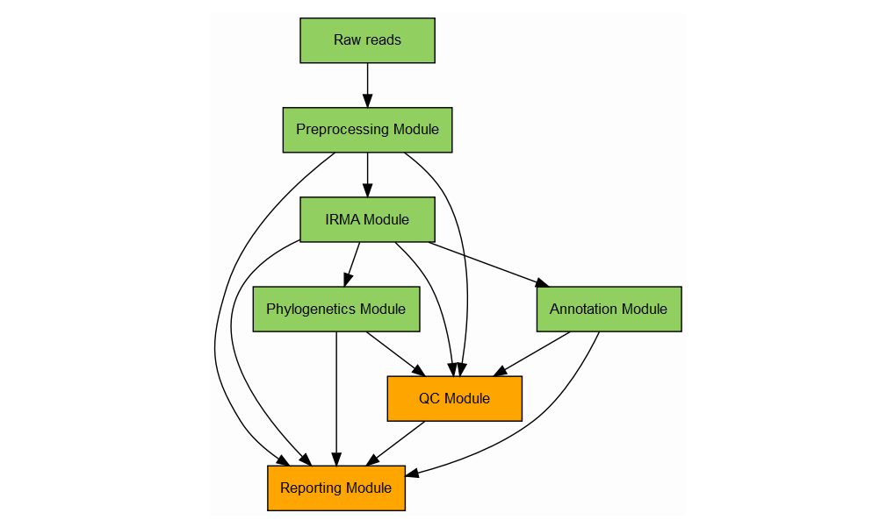
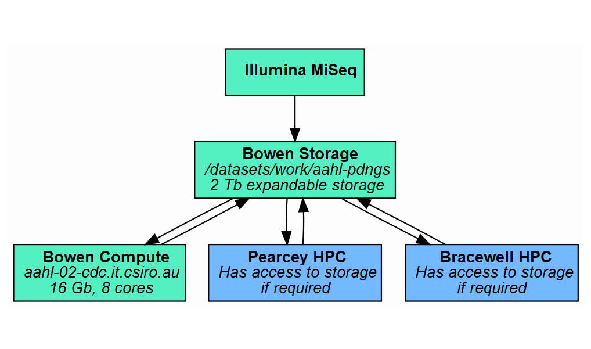

# AIV Pipeline Introduction
---

The AIV pipeline will take **raw Illumina MiSeq data** of avain influenza samples and produce a **word document** report suitable for sending to external clients. This requires a number of automated steps including trimming and quality control, influenza genome assembly, alignments and cleavage site identification, phylogenetic tree building and final generation of the report.

**Influenza sample data is available for testing in the raw_data folder of this repository.**

    * The raw data contains a sample where the complete genome was recovered and a sample where only a partial genome was recovered. Both the raw MiSeq fastq files and the manually assembled genomes are available. There is also a sequencing report for one of the samples in the folder.

A potential pipeline structure is below. **Please feel free to modify or comment on the structure.** These are just Matt's initial thoughts.

Each person can work on a seperate 'module' with defined inputs and outputs, thereby not relying on other parts of the pipeline. Once we decide who is going to work on particular modules, that person can 'git clone' the specific repository and work independantly. Probably best if only one person at a time works on a module, otherwise we'll get merge errors, etc.

* Please see the repositories of each module for specific input and output requirements. 

* The word document report will contain all figures, tables, captions, etc., but only *preliminary* interpretation statements. It is expected that laboratory staff will open the automatically generated word document and add interpretation / check outputs accordingly.

* As well as a report tailored towards clients, we may also need to generate a second report for laboratory staff that contains detailed QC information, etc., that may not be of interest to clients. This report could be in html format for better interactivity.

* Analysis of the cleavage site needs to indicate a *high* pathogentic or *low* pathogenic sequence.

    * We could also compare new cleavage sequences to all other sequences we have recovered (or even on NCBI) and report if the cleavage site is novel or where else it has been seen. 

* The QC module will indicate data quality, depth of coverage, etc., and if the data is suitable for reporting. Note a regular occurance is that we only get partial genomes where only a few segments are complete. This is still useful information for reporting, particularly if the full HA segment is recovered.

* IRMA is an assembly program from the CDC that Ivano has been using with generally good results. However, the coverage does need to be high enough otherwise IRMA can produce misassembles.

Another consideration is where the pipeline will run. I propose using the HPC systems and a bowen instance that I've already created as below.

* The MiSeq machine is networked, so data can be directly uploaded to the HPC systems.

* The aahl-02.cdc.it.csiro.au machine was created for another project but could also be used here. It doesn't have huge compute power but is probably ok in most cases.

* If we happen to have larger data, the Pearcey and Bracewell servers can also 'see' the Bowen storage location and can be used for analysis.

